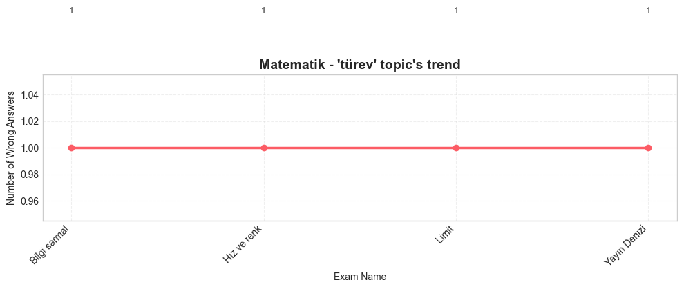
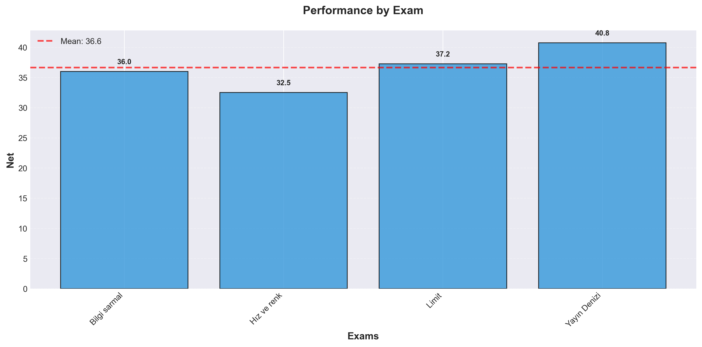
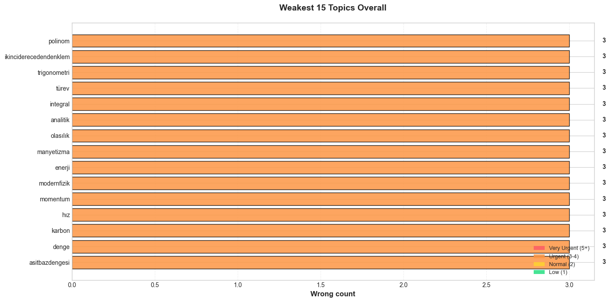
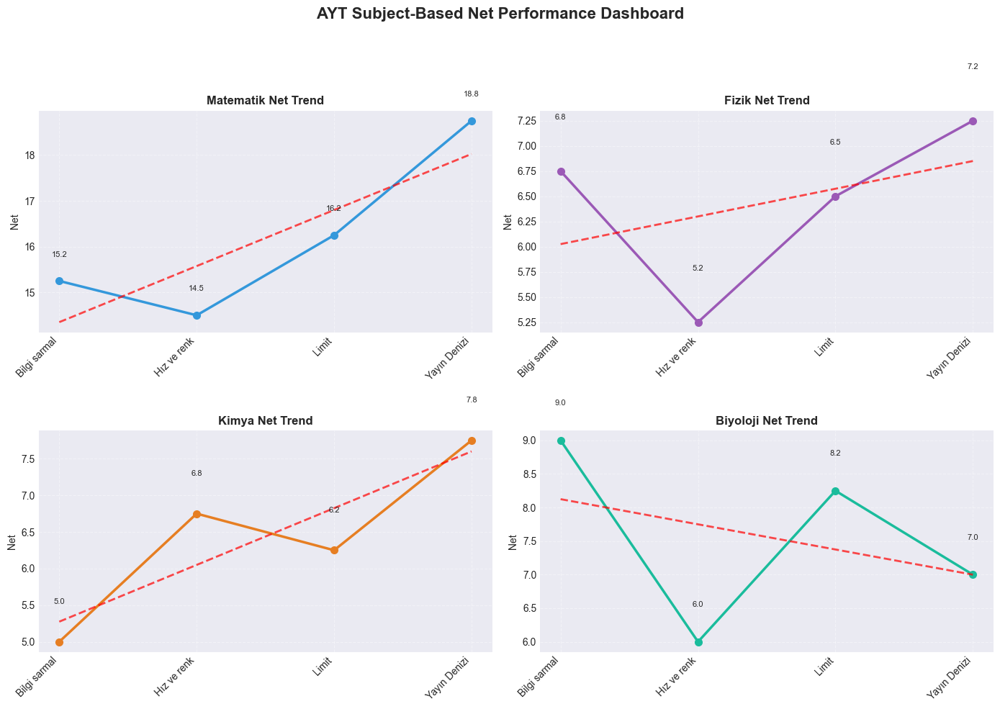
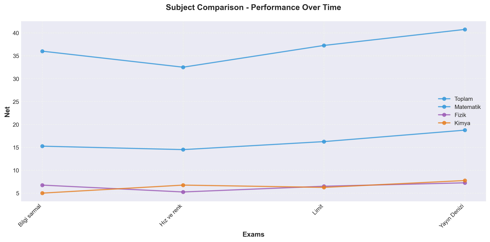

# 📊 YKS Practice Exam Tracking and Analysis System

This project is a modular Python application that retrieves the practice exam results of students preparing for YKS from Google Sheets, performs detailed net and subject analysis, visualizes the results with graphs, and provides personalized study recommendations.

## 🛠️ Technologies Used
- **Data Analysis:** Pandas, NumPy, SciPy
- **Visualization:** Matplotlib, Seaborn
- **Data Source:** Google Sheets API (gspread)
- **Environment Management:** python-dotenv
- **Working Environment:** Jupyter Notebook

## 🎯 Key Features
- **Data Management:** Thanks to Google Sheets integration, you can store your data in the cloud and access it from anywhere.
- **Automatic Data Cleaning:** Ensures the consistency of analyzes by automatically correcting incorrectly entered or missing data.
- **Detailed Net Analysis:** In addition to statistics such as mean and standard deviation on a course basis, it analyzes the trend of your nets with linear regression.
- **Smart Subject Analysis:** It identifies the most frequently incorrect subjects, determines your weak areas on a course basis, and analyzes your subject-based success trend.
- **Personalized Study Plan:** Based on subject analysis, it creates a special study plan for you according to priority levels such as "Very Urgent", "Urgent", "Medium".
- **Rich Visualization:** It allows you to see your performance clearly with more than 10 types of graphs created using Matplotlib and Seaborn.

## 🏗️ Project Architecture
The project is designed in a modular structure, with each module performing a specific task:

```
ders_takip/
│
├── 📂 analysis/           # Analysis scripts
│   ├── net_analyzer.py     # Net statistics, trend analysis
│   └── topic_analyzer.py   # Subject frequencies, study plan
│
├── 📂 data/                # Data loading and cleaning
│   ├── data_cleaner.py     # Data cleaning and validation
│   └── data_loader.py      # Reading data from Google Sheets
│
├── 📂 output/              # Analysis outputs
│   ├── 📂 charts/          # Generated graphs
│   └── 📂 data/            # Cleaned data and reports
│
├── 📂 visualization/       # Visualization scripts
│   ├── net_charts.py       # Net graphs (line, bar, etc.)
│   └── topic_charts.py     # Subject graphs (bar, heatmap, etc.)
│
├── 📜 config.py             # Center for all settings and constants
├── 📜 credentials.json     # Google API authorization key
├── 📜 main.ipynb            # Main Jupyter Notebook where all modules are used
├── 📜 requirements.txt      # Required Python libraries
└── 📜 README.md             # This file
```

## 🚀 Installation and Usage

### 1. Cloning the Project
```bash
git clone <https://github.com/AhmetBilalOzgun/YKS-Deneme-Takip-ve-Analiz-Sistemi>
cd ders_takip
```

### 2. Installing Required Libraries
For the project to work, the libraries specified in the `requirements.txt` file must be installed.
```bash
pip install -r requirements.txt
```

### 3. Google Sheets API Settings
You need to create and authorize a service account for the project to access Google Sheets.

**a) Google Cloud Console:**
1. Create a new project in the Google Cloud Console.
2. Enable "Google Sheets API" and "Google Drive API" from the "APIs & Services" > "Library" section.
3. Go to the "Credentials" section and create a new "Service Account".
4. Give "Editor" permission to the service account you created.
5. Create a JSON key for the service account, download it, and save it to the project folder as `credentials.json`.

**b) Sharing Google Sheets:**
1. Open the Google Sheets file containing your analysis data.
2. Click the "Share" button, add the `client_email` address from the `credentials.json` file, and give "Editor" permission.

### 4. Configuration
Edit the `config.py` file with your own information or, as a more secure method, create a `.env` file and write the variables there.

**.env file example:**
```
GOOGLE_SHEET_URL="[https://docs.google.com/spreadsheets/d/YOUR_SHEET_ID](https://docs.google.com/spreadsheets/d/YOUR_SHEET_ID)"
CREDENTIALS_PATH="credentials.json"
```

### 5. Running
You can run the entire analysis process by running the cells in the `main.ipynb` Jupyter Notebook in order.

## 📊 Sample Outputs
The project presents your net and subject analysis with both text-based reports and various graphs.

**Net Analysis Report**
```
=== TOTAL NET STATISTICS ===
  mean: 88.25
  std: 4.13
  min: 85.0
  max: 94.25
  latest: 87.5
```

**Subject Analysis Report**
```
=== RECOMMENDED STUDY PLAN ===
Matematik:
  1. problemler
     Priority: 🔴 High | Frequency: 4 | ➡️ Constant
  2. olasılık
     Priority: 🔴 High | Frequency: 4 | ➡️ Constant
```

## ✨ Sample Charts





